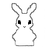

# Unity Simple Menu UX/UI
Creating a simple menu in Unity, EditorWindow to interleave between menus

  

## Plan and golas:

    Complete:
        1.Make a simple Menu to work
        2.Make simple CustomEditor
        3.Make a UI Controller
        4.Start Make Herarchy
    Todo:
        5.Add a Small Game to working
        6.Make Scene Manager
        7.Add State button and aniamtion in basic Menu
        8.Add Logo
        9.Animated Logo
            9.1 publish in asset Store
        10.Copy four menus and change color
        11.Switch Level with Custom WindowEditor
        12.Auto Set References
        13.Add EventsSystem Delegate System.
        14.Make confirm new game, second Quit Game menu confirm.
        15.Make a documentation
        16.Add diferents Menu, ConceptArt, Option,Credits, LoreBook.
        17.Validate Resources
        18.Add animation UX/UI
 

Goal: 
- Make a Simple menu for porfolioo and publish in Unity Asset Store(Main Goal).
- Second profesional presentation 

[Contactame me for](alexzimmer.zimmer1@gmail.com)

